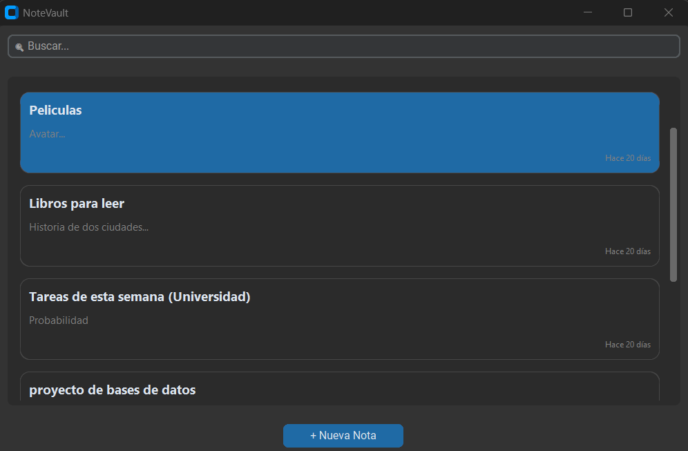

# 📝 NoteVault

Aplicación de escritorio para la gestión de notas desarrollada con Python, MongoDB y CustomTkinter.

<p align="center">


</p>

---

##  Descripción

NoteVault es una aplicación de escritorio inspirada en aplicaciones modernas de notas móviles.

Permite gestionar notas mediante operaciones CRUD completas utilizando MongoDB como base de datos documental.

El proyecto fue desarrollado aplicando arquitectura modular por capas, Docker para la base de datos y pruebas unitarias con pytest.

---

#  Características

- Crear notas  
- Editar notas  
- Eliminar notas  
- Buscar notas por título  
- Interfaz moderna estilo app móvil  
- Fechas relativas dinámicas  
- MongoDB con Docker  
- Arquitectura desacoplada  
- Testing con pytest  

---

#  Vista previa

> Interfaz moderna desarrollada con CustomTkinter.


---

#  Documentación

| Documento | Descripción |
|---|---|
| [ Documentación General](docs/README.md) | Documentación principal |
| [ Arquitectura](docs/architecture.md) | Arquitectura por capas |
| [ Base de Datos](docs/database.md) | MongoDB y operaciones CRUD |
| [ Testing](docs/testing.md) | Pruebas unitarias |

---

#  Arquitectura del Proyecto

```text
app/
├── config/          # Configuración MongoDB
├── models/          # Modelos de datos
├── repositories/    # CRUD y acceso a datos
├── services/        # Lógica de negocio
├── ui/              # Interfaz gráfica
├── utils/           # Funciones auxiliares
└── main.py          # Punto de entrada
```

---

#  MongoDB con Docker

Levantar contenedor:

```bash
docker compose up -d
```

Verificar contenedor:

```bash
docker ps
```

---
#  Variables de Entorno

Crear archivo `.env`:

```env
MONGO_URI=mongodb://localhost:27017/
DB_NAME=notevault_db
COLLECTION_NAME=notas
```

---

#  Instalación

##  Crear entorno virtual

```bash
python -m venv venv
```

---

##  Activar entorno virtual

### Windows

```bash
venv\Scripts\activate
```

---

##  Instalar dependencias

```bash
pip install -r requirements.txt
```

---

#  Ejecutar aplicación

```bash
python -m app.main
```

---

#  Ejecutar pruebas

```bash
pytest
```

## Coverage

```bash
pytest --cov=app
```

---

#  Tecnologías utilizadas

- Python
- MongoDB
- PyMongo
- Docker
- CustomTkinter
- Pytest

---

#  Notas Técnicas

- MongoDB se utiliza como base de datos documental NoSQL.
- La conexión se realiza mediante `pymongo`.
- Docker permite ejecutar MongoDB de forma aislada.
- El proyecto sigue una arquitectura desacoplada basada en capas.
- Se implementan operaciones CRUD completas.

